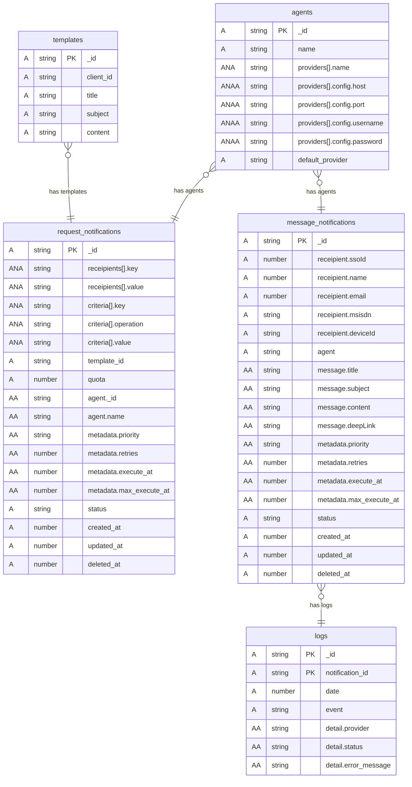

# Engine Notification

## API 
### Agents (GET)
#### response
    [
        {
            "id":"67764c4d1b5a837459257201",
            "name":"sms"
        },
        {
            "id":"a83745925720167764c4d1b5",
            "name":"whatsapp"
        },
        {
            "id":"a83745925720167764c4d1b5",
            "name":"email"
        },
    ]
### Tempalates (GET)
#### response
    [
        {
            "id":"67764c4d1b5a837459257201",
            "name":"notification expiration Subscription"
        },
        {
            "id":"a83745925720167764c4d1b5",
            "name":"notification Lebaran"
        },
    ]
### Request Notification (POST)
#### payload
    {
        "recipient": [
            {
                "key": "userId",
                "value": "12345"
            }
        ],
        //or
        "criteria": [
            {
                "field":"ssoId",
                "operation":"in",
                "value":[1312,123123,123123]
            }
        ],
        "template_id": "67764c4d1b5a837459257201",
        "quota": 200,
        "agent": "email",
        "meta_data": {
            "priority": "high",
            "retries":0,
            "execute_at": 1698637555585,
            "max_execute_at":1698637555585
        }
    }

## Schema

<b>message_notifications</b> is an  <i>Abstraction</i> of <b>request_notifications</b> per <u>user</u>.

request_notifications contains: 
<b>recipient</b> array or <b>criteria</b> array that is used to get users to whom notifications will be sent 
<b>template_id</b> that is used to get message content 
<b>agent_id</b> that is used to get agent notification 
<b>metadata</b> that is used to details execute notification 
<b>status</b> as progress status request notification 

### Schema Design

## QUEUE
### Exchange
    engine.notification
#### RoutingKey
#### 
    create
##### payload 
    {
        "recipient": [
            {
                "key": "userId",
                "value": "12345"
            }
        ],
        "criteria": [
            {

            }
        ],
        "template_id": {
            "_id": "6654d406a0361ef5331c6b42",
            "name": "template notif A",
        },
        "quota": 200,
        "agent": {
            "_id": "6654d406a0361ef5331c6b42",
            "name": "email",
        },
        "meta_data": {
            "priority": "high",
            "retries":0,
            "execute_at": 1698637555585,
            "max_execute_at":1698637555585
        }
    }
####
    attempt
##### payload
    {
        "_id": "6654d4aea0361ef5331c7b23",
        "recipient": {
            "ssoId": 123455,
            "email": "jhon.pantau@gmail.com",
            "name": "Jhon Pantau",
        },
        "message": {
            "title": "lalala",
            "subject": "yeyeyeye",
            "content": "content message",
        },
        "agent": "email",
        "meta_data": {
            "priority": "high",
            "retries":0,
            "execute_at": 1698637555585,
            "max_execute_at":1698637555585
        },
        "status": "waiting"
    }
####
    update_attempt
##### payload success
    {
        "_id": "6654d4aea0361ef5331c7b23",
        "result": {
            "success": true,
            "status": "success",
            "code":"",
            "error_message":""
        } 
    }
##### payload failed
    {
        "_id": "6654d4aea0361ef5331c7b23",
        "result": {
            "success": false,
            "status": "failed",
            "code":"",
            "error_message":""
        } 
    }